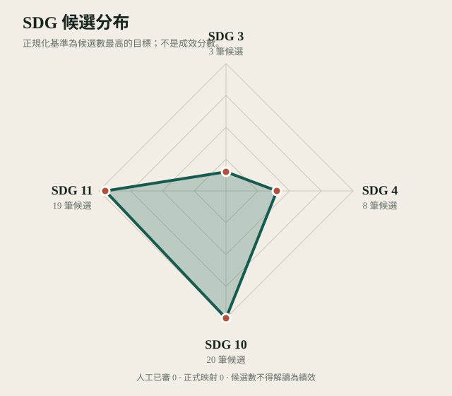

# 萬華區 SDG 候選涵蓋分析

資料日期：2026-08-03

## 重要說明

本頁的「候選數」不是正式涵蓋率，也不是活動成果。正式映射數目前為 **0**，必須待人工覆核後才能更新。

## 候選目標分布

| 目標 | 名稱 | 候選數 | 已人工覆核 | 狀態 |
| --- | --- | ---: | ---: | --- |
| SDG 3 | 健康與福祉 | 3 | 0 | 待人工覆核 |
| SDG 4 | 優質教育 | 8 | 0 | 待人工覆核 |
| SDG 10 | 減少不平等 | 20 | 0 | 待人工覆核 |
| SDG 11 | 永續城市與社區 | 19 | 0 | 待人工覆核 |

## 年度候選分布

| 年度 | SDG 3 | SDG 4 | SDG 10 | SDG 11 | 合計 |
| ---: | ---: | ---: | ---: | ---: | ---: |
| 2023 | 0 | 1 | 2 | 2 | 5 |
| 2024 | 3 | 7 | 8 | 12 | 30 |
| 2025 | 0 | 0 | 5 | 5 | 10 |
| 2026 | 0 | 0 | 5 | 0 | 5 |

## 社區候選覆蓋

| ID | 社區 | 候選數 | 狀態 |
| --- | --- | ---: | --- |
| COM-0001 | 華江 | 1 | 候選待覆核 |
| COM-0002 | 富福 | 0 | 本次活動母體未匹配 |
| COM-0003 | 雙園 | 0 | 本次活動母體未匹配 |
| COM-0004 | 堀江町 | 2 | 候選待覆核 |
| COM-0005 | 中正新城 | 7 | 候選待覆核 |
| COM-0006 | 忠貞 | 2 | 候選待覆核 |
| COM-0007 | 新忠 | 9 | 候選待覆核 |
| COM-0008 | 忠恕 | 0 | 本次活動母體未匹配 |
| COM-0009 | 全德家園 | 0 | 本次活動母體未匹配 |
| COM-0010 | 保德 | 6 | 候選待覆核 |
| COM-0011 | 壽德 | 4 | 候選待覆核 |
| COM-0012 | 萬大 | 1 | 候選待覆核 |
| COM-0013 | 好厝邊 | 2 | 候選待覆核 |
| COM-0014 | 糖廍 | 0 | 本次活動母體未匹配 |
| COM-0015 | 福音 | 1 | 候選待覆核 |
| COM-0016 | 艋舺 | 0 | 本次活動母體未匹配 |
| COM-0017 | 綠堤 | 2 | 候選待覆核 |
| COM-0018 | 日祥 | 1 | 候選待覆核 |
| COM-0019 | 南一 | 0 | 本次活動母體未匹配 |
| COM-0020 | 展新 | 0 | 本次活動母體未匹配 |
| COM-0021 | 新國光 | 0 | 本次活動母體未匹配 |
| COM-0022 | 新和七普拉斯 | 0 | 本次活動母體未匹配 |
| COM-0023 | 青年 | 5 | 候選待覆核 |
| COM-0024 | 馬場町 | 2 | 候選待覆核 |
| COM-0025 | 國興水漾 | 0 | 本次活動母體未匹配 |
| COM-0026 | 忠德友善 | 1 | 候選待覆核 |
| COM-0027 | 忠德 | 0 | 本次活動母體未匹配 |
| COM-0028 | 我愛加蚋錦德 | 0 | 本次活動母體未匹配 |
| COM-0029 | 和平 | 1 | 候選待覆核 |
| COM-0030 | 菜園 | 1 | 候選待覆核 |
| COM-0031 | 新起 | 0 | 本次活動母體未匹配 |
| COM-0032 | 愛在孝德 | 2 | 候選待覆核 |
| COM-0033 | 西門 | 0 | 本次活動母體未匹配 |

## 雷達圖

雷達圖以候選紀錄數最高的目標作正規化基準，只呈現審查工作量分布，不表示目標達成程度或社區績效。
